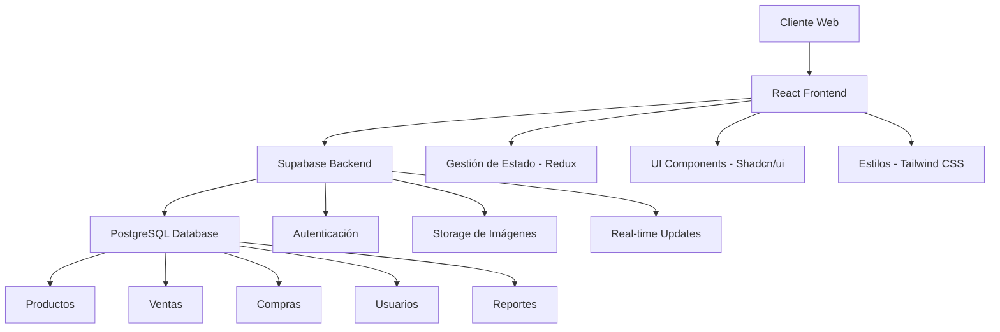
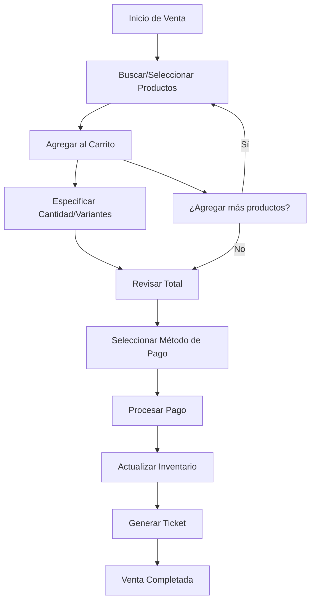
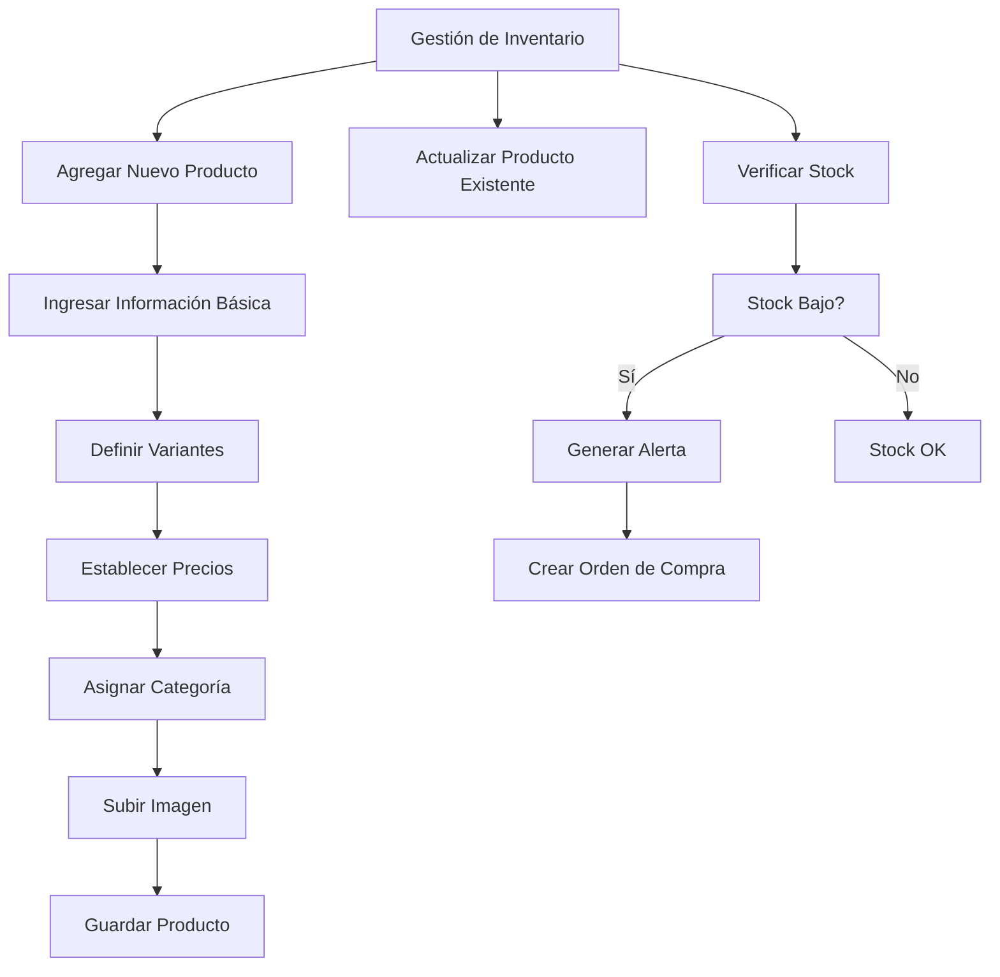
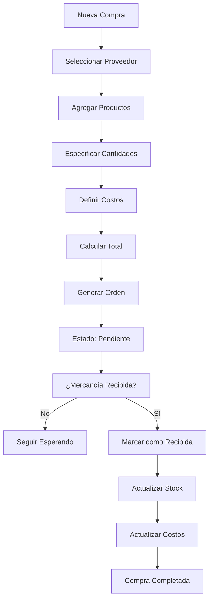

# 👗 Cloth Flow POS - Sistema de Punto de Venta para Tiendas de Ropa

Un sistema de punto de venta moderno y completo diseñado específicamente para tiendas de ropa y boutiques. Cloth Flow POS ofrece una solución integral para gestionar ventas, inventario, compras y reportes de manera eficiente y profesional.

## 🌟 Características Principales

### 💰 Punto de Venta Intuitivo
- **Interfaz moderna y fácil de usar** para procesamiento rápido de ventas
- **Búsqueda avanzada** de productos por nombre, SKU o categoría
- **Gestión de variantes** (tallas, colores) para productos textiles
- **Múltiples métodos de pago** (efectivo, tarjeta, transferencia)
- **Generación automática** de tickets y facturas

### 📦 Gestión de Inventario Completa
- **Control de stock en tiempo real** con alertas automáticas
- **Gestión de categorías** para organizar productos textiles
- **Seguimiento de costos y precios** con cálculo automático de márgenes
- **Alertas de stock bajo** y productos agotados
- **Historial completo** de movimientos de inventario

### 🛒 Administración de Compras
- **Registro de proveedores** y gestión de contactos
- **Órdenes de compra** con seguimiento de estado
- **Recepción de mercancía** con actualización automática de stock
- **Control de costos** y análisis de proveedores
- **Fechas de entrega** y seguimiento de pedidos

### 📊 Reportes y Análisis Avanzados
- **Dashboard ejecutivo** con métricas clave en tiempo real
- **Reportes de ventas** por período, producto y categoría
- **Análisis de inventario** con valor total y rotación
- **Exportación a Excel** para análisis detallados
- **Importación masiva** de productos desde Excel

### 🔐 Seguridad y Control de Acceso
- **Autenticación segura** con diferentes niveles de usuario
- **Control de sesiones** con timeout automático por inactividad
- **Respaldo automático** en la nube con Supabase
- **Auditoría completa** de transacciones y cambios

## 🏗️ Arquitectura del Sistema



## 🔄 Flujo de Procesos Principales

### Flujo de Ventas


### Flujo de Gestión de Inventario


### Flujo de Compras


## 🎯 Beneficios para tu Negocio

### 📈 Incrementa tus Ventas
- **Proceso de venta más rápido** = más clientes atendidos
- **Control de inventario preciso** = menos ventas perdidas por falta de stock
- **Análisis de productos más vendidos** para optimizar tu oferta

### 💰 Reduce Costos Operativos
- **Automatización de procesos** reduce errores manuales
- **Control de proveedores** optimiza costos de compra
- **Reportes automáticos** ahorran tiempo en administración

### 🎯 Mejora la Experiencia del Cliente
- **Atención más rápida** en punto de venta
- **Disponibilidad precisa** de productos y variantes
- **Proceso de pago eficiente** con múltiples opciones

### 📊 Decisiones Basadas en Datos
- **Métricas en tiempo real** para decisiones inmediatas
- **Análisis de tendencias** para planificación estratégica
- **Reportes detallados** para control financiero

## 🚀 Tecnologías de Vanguardia

### Frontend Moderno
- **React 18** - Framework líder para interfaces de usuario
- **TypeScript** - Desarrollo seguro y mantenible
- **Tailwind CSS** - Diseño responsive y profesional
- **Shadcn/ui** - Componentes de interfaz premium

### Backend Robusto
- **Supabase** - Backend como servicio con PostgreSQL
- **Autenticación segura** con JWT y RLS
- **API REST** escalable y eficiente
- **Storage en la nube** para imágenes de productos

### Características Técnicas
- **Progressive Web App (PWA)** - Funciona offline
- **Responsive Design** - Perfecto en móvil, tablet y desktop
- **Real-time Updates** - Sincronización instantánea
- **Backup automático** - Tus datos siempre seguros

## 📱 Compatibilidad

- ✅ **Desktop** - Windows, macOS, Linux
- ✅ **Tablet** - iPad, Android tablets
- ✅ **Móvil** - iOS, Android
- ✅ **Navegadores** - Chrome, Firefox, Safari, Edge

## 🎯 Casos de Uso Ideales

### 👕 Tiendas de Ropa
- Boutiques de moda femenina y masculina
- Tiendas de ropa casual y formal
- Tiendas de ropa deportiva

### 👗 Especializadas
- Tiendas de vestidos de novia
- Ropa infantil y juvenil
- Accesorios y complementos

### 🏪 Formatos de Negocio
- Tiendas físicas individuales
- Cadenas de tiendas pequeñas
- Showrooms y outlets
- Tiendas con venta online

## 💡 ¿Por qué Elegir Cloth Flow POS?

### ⚡ Implementación Rápida
- **Configuración en minutos**, no semanas
- **Migración de datos** asistida y sin pérdidas
- **Capacitación incluida** para tu equipo

### 🔧 Personalizable
- **Adaptable a tu flujo de trabajo** específico
- **Categorías personalizadas** para tu tipo de productos
- **Reportes a medida** según tus necesidades

### 🚀 Escalable
- **Crece con tu negocio** sin limitaciones
- **Múltiples ubicaciones** en un solo sistema
- **Usuarios ilimitados** según tu plan

### 💪 Soporte Completo
- **Soporte técnico especializado** en español
- **Actualizaciones automáticas** sin costo adicional
- **Documentación completa** y tutoriales

## 🛠️ Instalación y Configuración

### Requisitos del Sistema
```
- Navegador web moderno (Chrome, Firefox, Safari, Edge)
- Conexión a internet estable
- Dispositivo con mínimo 2GB RAM
```

### Configuración Rápida
1. **Acceso inmediato** a través del navegador web
2. **Configuración de empresa** y datos básicos
3. **Importación de productos** existentes (opcional)
4. **Configuración de usuarios** y permisos
5. **¡Listo para vender!**

## 📞 Contacto y Demostración

¿Interesado en revolucionar tu tienda de ropa con Cloth Flow POS?

- 📧 **Email**: info@clothflowpos.com
- 📱 **WhatsApp**: +52 123 456 7890
- 🌐 **Demo en vivo**: [Solicitar demostración](https://clothflowpos.com/demo)
- 📅 **Prueba gratuita**: 30 días sin compromiso

---

## 📋 Para Desarrolladores

### Tecnologías Utilizadas
- **Frontend**: React 18, TypeScript, Vite
- **UI Framework**: Shadcn/ui, Tailwind CSS
- **Backend**: Supabase (PostgreSQL)
- **Estado**: Redux Toolkit, TanStack Query
- **Autenticación**: Supabase Auth

### Instalación Local
```bash
# Clonar el repositorio
git clone <YOUR_GIT_URL>

# Instalar dependencias
cd cloth-flow-pos
npm install

# Configurar variables de entorno
cp .env.example .env.local
# Editar .env.local con tus credenciales de Supabase

# Ejecutar en desarrollo
npm run dev
```

### Estructura del Proyecto
```
src/
├── components/     # Componentes reutilizables
├── pages/         # Páginas principales
├── hooks/         # Custom hooks
├── store/         # Estado global (Redux)
├── lib/           # Utilidades y configuración
└── types/         # Definiciones de TypeScript
```

---

*Cloth Flow POS - Transformando el retail de moda, una venta a la vez.* 🚀👗
